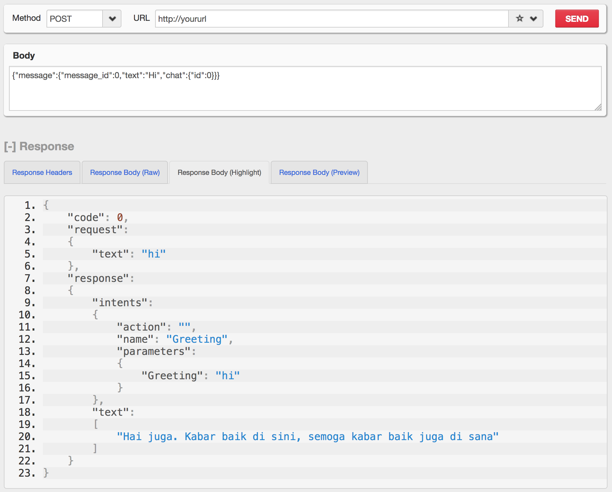

# SimpleBOT Package

## What is it?


SimpleBOT merupakan salah satu contoh penggunaan NLP SimpleAI yang dipergunakan untuk membuat BOT.
Memiliki fitur menjawab otomatis, dan belajar suatu definisi kata sederhana.
Kecerdasan Bot ini tergantung dari data entities dan intent yang Anda miliki, serta logic handler yang Anda buat.

Contoh penggunaan bot sederhana dengan SimpleBOT ini bisa anda coba dari situs [ai.fastplaz.com](http://ai.fastplaz.com) atau bisa melalu aplikasi chat **Telegram**, silahkan hubungi contact *'Fastplaz Bot'*.


## Why use it?

**Ringan Tanpa Beban**

SimpleBOT dibuat dengan sederhana, simple dan ringan. SimpleBOT adalah _binary application_ sehingga diharapkan akan lebih cepat dan ringan. 


## How to use it


### Requirements


- [FastPlaz_runtime](http://www.fastplaz.com)
- SimpleAI package

### Instalasi

Gunakan Lazarus, buka file "simplebot_package.lpk" dan install file tersebut.
Jangan lupa, instalasi ini membutuhkan SimpleAI package.

### SimpleBOT USAGE

```
  SimpleBOT := TSimpleBotModule.Create;
  SimpleBOT.OnError := @OnErrorHandler;  // Your Custom Message
  text_response := SimpleBOT.Exec(Text);
  SimpleBOT.Free;

```

Fungsi 'OnErrorHandler' bisa digunakan untuk melakukan trapping terhadap kata/kalimat yang belum diakomodir oleh data SimpleAI

```delphi
function TMainModule.OnErrorHandler(const Message: string): string;
begin
  .
  .
  .
  // save to log file
  LogUtil.Add(Message, 'AI');
  
  // or save to database
  .
  .
  Result := 'Your custom messages';
end;
```

### User Data

SimpleBOT menyediakan fitur menyimpan data user untuk kebutuhan temporer.

```delphi
  SimpleBOT := TSimpleBotModule.Create;
  ..
  ..
  
  // Set
  SimpleBOT.UserData[ 'Name'] := 'Luri Darmawan'
  
  // Get
  varstring := SimpleBOT.UserData[ 'Name'];
  
  ..
  ..

  SimpleBOT.Free;

```




## Documentation

Take a look at the repo [Wiki](https://github.com/luridarmawan/SimpleAI/wiki) for further information and tutorials!
Feel free to improve!

## Projects with this library

Here's a list of projects that feats this library, feel free to add yours!

- [SimpleBOT example](https://github.com/luridarmawan/SimpleBOT/) 


## Troubleshooting

If you like living on the edge, please report any bugs you find on the
[SimpleAI issues](https://github.com/luridarmawan/SimpleAI/issues) page.

## Contributing

See [CONTRIBUTING](CONTRIBUTING.md) for more information.

## License

Please see the [LICENSE](LICENSE.txt) included in this repository,
which this project is licensed under.

## Credits

Credit list in [CREDITS](CREDITS)

[Carik Bot](http://www.carik.id/) 